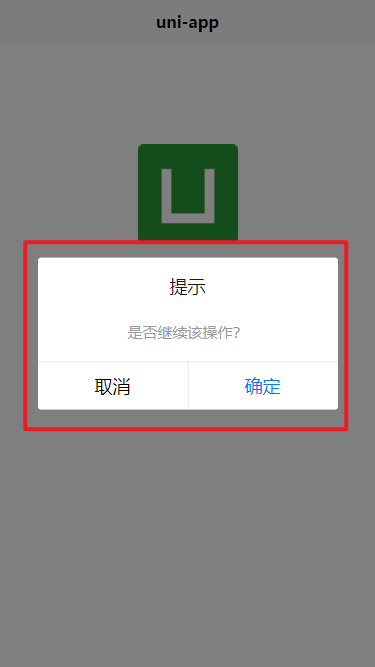

# TODO

1. [x] 通过传入config实现配置请求，不用写一大堆代码
2. [x] 每次请求可以自动带上一些数据，比如极智报销里的`user_id`
3. [x] 乐观更新功能, 先响应界面后请求，出现问题再提示
4. [x] 控制是否显示loading
5. [x] 是否显示错误提示
6. [x] 断开网络了会直接提示
7. [x] 超出请求时间会关闭请求或加载

## 介绍

在原先的uniapp开发中，为了提供更友好的交互，通常需要写频繁loading和toast提示用户，现在只需要一行代码即可完成这些功能：`http.setOptions().get('/v2/invoice/list', data)`
,是否显示loading和toast，现在只需要在`setOptions（）`传入指定参数控制即可。
以前调试的时候经常需要进入network中查看传入参数和返回参数，现在可以直接将请求的关键信息打印到控制台。

- 网络检测：断网状态显示：
- 
- loading
    - 可以开启关闭请求等待接口相应的loading
    - 
    - 同时也可以方便的定义
- 详细打印请求信息，绿色表示状态为200，红色表示非200
    - 
  另外还有成功和失败的提示，基于200和非200
- 
- 
  -
    -

## 功能

### 配置

#### config

baseUrl:请求的基础地址
defaultParams：每次请求携带的默认参数
。。。

```ts
const http = new useApi({
    loadingText: '加载中~~~~~' // 配置加载中的文字显示
});
const testGet = () => http.setOptions().get('/v2/invoice/list', {a: '111'})
testGet()
```


### 单个请求配置

```ts
/**
 * This function sets the options for a request.
 *
 * @param {Object} options The options for the request.
 * @param {string} options.sucMsg The success message.
 * @param {string} options.failMsg The failure message.
 * @param {boolean} options.isShowLoading Flag to show/hide loading.
 * @param {boolean} options.isShowSucToast Flag to show/hide success toast.
 * @param {boolean} options.isShowErrToast Flag to show/hide error toast.
 * @param {boolean} options.isOptimisticUpdateEnabled Flag for enabling optimistic update.
 * @param {Object} options.header The header for the request.
 * @param {boolean} options.isDebug Flag for enabling/disabling debug.
 * @param {boolean} options.isWarn Poup a model.
 * @return {useAxios} The useAxios instance.
 */

const http = new useApi();
const testGet = () => http.setOptions({isShowLoading: false}).get('/v2/invoice/list', {a: '111'})
testGet()
```

#### 乐观更新

`setOptions({isOptimisticUpdateEnabled:true})`, 默认false,


#### 弹窗警告

删除这样的重要操作，需要重点提示用户，防止用户误操作

使用示例：

```ts
.
setOptions({isWarn: true})
```

## 实战教程

```ts
async
request()
{
    const http = new useApi({
        loadingText: '加载中~~~~~',
    });
    const testGet = () => http.setOptions({isWarn: true}).get('/v2/invoice/list', {a: '111'})
    testGet()
}
```


